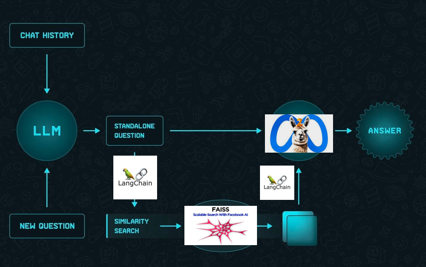
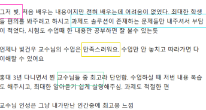
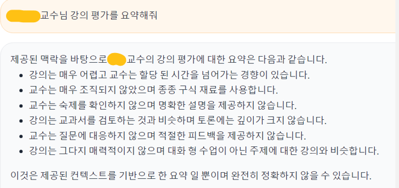

# Llama 2 Korean Chatbot

영어 기반 LLM인 Llama2의 한국어 챗봇 오픈소스 프로젝트입니다.
</br></br>
Open source language chat model based on Llama2 optimized for Korean.

## Problem

From GPT to Bert to Llama, the amazing advances in large-scale language models have captured everyone's attention. However, due to the nature of LLMs pre-training on large corpora, the vast majority of training data is spoken in English, with Korean representing a very small percentage.

- Percentage of Korean in the Llama2 model's pre-training data: 0.06%.

<p align="center" style="color:gray">
  
  <br/>22p Table 10, Llama 2: Open Foundation and Fine-Tuned Chat Models, Hugo Touvron et al, July 18-2023.
</p> 

This percentage is significantly lower than the percentage of Korean speakers (81.7M) in the world's population (7.888 billion) (1.035%). This is based on a number of factors, including the isolated nature of Korean, an unprepared Korean corpus, and more, but the end result is that Korean speakers are severely limited in experiencing the richness of LLM.

## Overview

<p align="center">
  
</p>

## Translate API

We didn't fine-tune the Korean language and added translators to the inputs and outputs respectively. This performed much better than fine-tune the Korean language.

Input: Papago

```
def translate_to_en(text):
    client_id = ""
    client_secret = ""
    data = {'text' :text,
            'source' : 'ko',
            'target' : 'en'}
    url = "https://openapi.naver.com/v1/papago/n2mt"
    header={"X-Naver-client-Id":client_id,
           "X-Naver-client-Secret":client_secret}
    response = requests.post(url, headers=header, data=data)
    res = response.status_code
    
    if(res==200):
        send_data = response.json()
        trans_data = (send_data['message']['result']['translatedText'])
        return trans_data
    else:
        print("Error code:", res)
```

Output: Google Translate

```
def qa(user_input):
    user_input = str(user_input)
    user_input = translate_to_en(user_input)
    user_input = str(user_input)
    resp = qa_chain({'question':user_input, 'chat_history': chat_history})
    resp = str(resp['answer'])
    resp = translator.translate(resp, dest='ko').text
    return resp
```

## Natural Language Generation (Hongik Univ.)

<p align="left">
  
  
</p>

</br>


## References

1. [Research Paper](https://ai.meta.com/research/publications/llama-2-open-foundation-and-fine-tuned-chat-models/)
2. [Llama 2 technical overview](https://ai.meta.com/resources/models-and-libraries/llama)
3. [Open Innovation AI Research Community](https://ai.meta.com/llama/open-innovation-ai-research-community/)

</br>

# Llama 2

We are unlocking the power of large language models. Our latest version of Llama is now accessible to individuals, creators, researchers and businesses of all sizes so that they can experiment, innovate and scale their ideas responsibly. 

This release includes model weights and starting code for pretrained and fine-tuned Llama language models — ranging from 7B to 70B parameters.

This repository is intended as a minimal example to load [Llama 2](https://ai.meta.com/research/publications/llama-2-open-foundation-and-fine-tuned-chat-models/) models and run inference. For more detailed examples leveraging Hugging Face, see [llama-recipes](https://github.com/facebookresearch/llama-recipes/).

## Updates post-launch

See [UPDATES.md](UPDATES.md). Also for a running list of frequently asked questions, see [here](https://ai.meta.com/llama/faq/).

## Download

⚠️ **7/18: We're aware of people encountering a number of download issues today. Anyone still encountering issues should remove all local files, re-clone the repository, and [request a new download link](https://ai.meta.com/resources/models-and-libraries/llama-downloads/). It's critical to do all of these in case you have local corrupt files.**

In order to download the model weights and tokenizer, please visit the [Meta website](https://ai.meta.com/resources/models-and-libraries/llama-downloads/) and accept our License.

Once your request is approved, you will receive a signed URL over email. Then run the download.sh script, passing the URL provided when prompted to start the download.

Pre-requisites: Make sure you have `wget` and `md5sum` installed. Then to run the script: `./download.sh`.

Keep in mind that the links expire after 24 hours and a certain amount of downloads. If you start seeing errors such as `403: Forbidden`, you can always re-request a link.

### Access on Hugging Face

We are also providing downloads on [Hugging Face](https://huggingface.co/meta-llama). You must first request a download from the Meta website using the same email address as your Hugging Face account. After doing so, you can request access to any of the models on Hugging Face and within 1-2 days your account will be granted access to all versions.

## Quick Start

You can follow the steps below to quickly get up and running with Llama 2 models. These steps will let you run quick inference locally. For more examples, see the [Llama 2 recipes repository](https://github.com/facebookresearch/llama-recipes). 

1. In a conda env with PyTorch / CUDA available clone and download this repository.

2. In the top level directory run:
    ```bash
    pip install -e .
    ```
3. Visit the [Meta website](https://ai.meta.com/resources/models-and-libraries/llama-downloads/) and register to download the model/s.

4. Once registered, you will get an email with a URL to download the models. You will need this URL when you run the download.sh script.

5. Once you get the email, navigate to your downloaded llama repository and run the download.sh script. 
    - Make sure to grant execution permissions to the download.sh script
    - During this process, you will be prompted to enter the URL from the email. 
    - Do not use the “Copy Link” option but rather make sure to manually copy the link from the email.

6. Once the model/s you want have been downloaded, you can run the model locally using the command below:
```bash
torchrun --nproc_per_node 1 example_chat_completion.py \
    --ckpt_dir llama-2-7b-chat/ \
    --tokenizer_path tokenizer.model \
    --max_seq_len 512 --max_batch_size 6
```
**Note**
- Replace  `llama-2-7b-chat/` with the path to your checkpoint directory and `tokenizer.model` with the path to your tokenizer model.
- The `–nproc_per_node` should be set to the [MP](#inference) value for the model you are using.
- Adjust the `max_seq_len` and `max_batch_size` parameters as needed.
- This example runs the [example_chat_completion.py](example_chat_completion.py) found in this repository but you can change that to a different .py file.

## Inference

Different models require different model-parallel (MP) values:

|  Model | MP |
|--------|----|
| 7B     | 1  |
| 13B    | 2  |
| 70B    | 8  |

All models support sequence length up to 4096 tokens, but we pre-allocate the cache according to `max_seq_len` and `max_batch_size` values. So set those according to your hardware.

### Pretrained Models

These models are not finetuned for chat or Q&A. They should be prompted so that the expected answer is the natural continuation of the prompt.

See `example_text_completion.py` for some examples. To illustrate, see the command below to run it with the llama-2-7b model (`nproc_per_node` needs to be set to the `MP` value):

```
torchrun --nproc_per_node 1 example_text_completion.py \
    --ckpt_dir llama-2-7b/ \
    --tokenizer_path tokenizer.model \
    --max_seq_len 128 --max_batch_size 4
```

### Fine-tuned Chat Models

The fine-tuned models were trained for dialogue applications. To get the expected features and performance for them, a specific formatting defined in [`chat_completion`](https://github.com/facebookresearch/llama/blob/main/llama/generation.py#L212)
needs to be followed, including the `INST` and `<<SYS>>` tags, `BOS` and `EOS` tokens, and the whitespaces and breaklines in between (we recommend calling `strip()` on inputs to avoid double-spaces).

You can also deploy additional classifiers for filtering out inputs and outputs that are deemed unsafe. See the llama-recipes repo for [an example](https://github.com/facebookresearch/llama-recipes/blob/main/inference/inference.py) of how to add a safety checker to the inputs and outputs of your inference code.

Examples using llama-2-7b-chat:

```
torchrun --nproc_per_node 1 example_chat_completion.py \
    --ckpt_dir llama-2-7b-chat/ \
    --tokenizer_path tokenizer.model \
    --max_seq_len 512 --max_batch_size 6
```

Llama 2 is a new technology that carries potential risks with use. Testing conducted to date has not — and could not — cover all scenarios.
In order to help developers address these risks, we have created the [Responsible Use Guide](Responsible-Use-Guide.pdf). More details can be found in our research paper as well.

## Issues

Please report any software “bug”, or other problems with the models through one of the following means:
- Reporting issues with the model: [github.com/facebookresearch/llama](http://github.com/facebookresearch/llama)
- Reporting risky content generated by the model: [developers.facebook.com/llama_output_feedback](http://developers.facebook.com/llama_output_feedback)
- Reporting bugs and security concerns: [facebook.com/whitehat/info](http://facebook.com/whitehat/info)

## Model Card
See [MODEL_CARD.md](MODEL_CARD.md).

## License

Our model and weights are licensed for both researchers and commercial entities, upholding the principles of openness. Our mission is to empower individuals, and industry through this opportunity, while fostering an environment of discovery and ethical AI advancements. 

See the [LICENSE](LICENSE) file, as well as our accompanying [Acceptable Use Policy](USE_POLICY.md)

## References

1. [Research Paper](https://ai.meta.com/research/publications/llama-2-open-foundation-and-fine-tuned-chat-models/)
2. [Llama 2 technical overview](https://ai.meta.com/resources/models-and-libraries/llama)
3. [Open Innovation AI Research Community](https://ai.meta.com/llama/open-innovation-ai-research-community/)

For common questions, the FAQ can be found [here](https://ai.meta.com/llama/faq/) which will be kept up to date over time as new questions arise. 

## Original LLaMA
The repo for the original llama release is in the [`llama_v1`](https://github.com/facebookresearch/llama/tree/llama_v1) branch.
